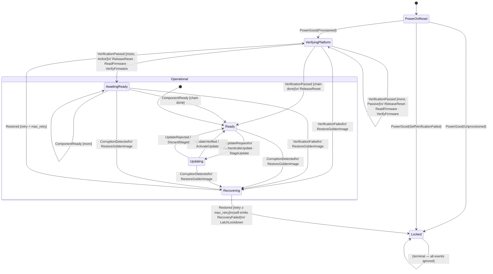

# `rot_reducer`

A reusable **Root-of-Trust HSM** state machine for OCP-style platform security,
written as a *sans-IO* reducer: the core is a pure function of
`(state, event, shared storage)` — where *shared storage* is statig's term for
the single struct passed into every handler, shared across all states because
states are unit variants that carry no data themselves; here that struct is
`Rot<N>`, holding the chain cursor (an index into the ordered list of components
being verified, so the walk can resume across events), retry count, and the rest of the machine's
persistent data — that **describes**
side effects instead of performing them. It never touches hardware, never reads the world, and names no
concrete component — a board layer supplies all of that.

Engine: [`statig`](https://crates.io/crates/statig) 0.4.1 with hand-written
(macro-free) trait impls. `#![no_std]`, `#![forbid(unsafe_code)]`, two deps
(`heapless` + `statig`).

```text
        world (board / shell)                          this crate (pure core)
   ┌───────────────────────────┐                 ┌──────────────────────────────┐
   │  reads OTP/UFM, hardware   │   Event  ──────►│  Orchestrator (dispatch loop)│
   │  IRQs, measurement results │                 │      │                       │
   │                            │                 │      ▼                       │
   │  Platform::execute(effect) │◄────── Effect ──│  StateMachine<Rot<N>>        │
   │  drives flash/reset/bus    │                 │   State × Superstate handlers│
   └───────────────────────────┘                 └──────────────────────────────┘
     examples/board.rs                              src/lib.rs
```

The world speaks to the core **only** through `Event`s; the core speaks back
**only** through `Effect`s. That single firewall is what makes every run
replayable and every test an assertion over an ordered `Vec<Effect>`.

## An execution model for OpenPRoT

This crate is an **executable model of the OpenPRoT PRoT security lifecycle** —
boot-time trust chain, attestation, firmware update, and corruption recovery.
Each requirement becomes a state transition; every mandated behaviour is an
assertion over an ordered `Vec<Effect>`. See [`docs/verification-model.md`](docs/verification-model.md)
for the full domain mapping and why identity/DICE is out of scope.

## Layers

| Layer | Lives in | Knows about |
| --- | --- | --- |
| **Core** (state machine + dispatch loop) | `src/lib.rs` | opaque ids only — no hardware, no counts |
| **Board / deployment policy** | `examples/board.rs` | concrete components, chain order, capacity, retry cap; measurement transport (SPI interposition, I3C, MCTP, …) |
| **Shell / OS loop** | the caller | event delivery, effect routing, threading |

The core is generic over chain capacity (`N`) and takes `max_retry` as a
constructor argument; the board picks both.

## State machine



See [`docs/state-machine.md`](docs/state-machine.md) for entry actions, per-state event tables, and the `AwaitingReady` active-component gate.

## Types

| Type | Kind | Role |
| --- | --- | --- |
| `ComponentId` | value | Opaque `u8` identity; the core only carries and equality-compares it. |
| `ComponentKind` | enum | `Active` (has embedded iRoT) or `Passive` (eRoT auth only). |
| `PowerOnResult` | enum | `Provisioned` / `Unprovisioned` / `SelfVerificationFailed` — delivered in `PowerGood`. |
| `Event` | enum | Everything the world tells the core. |
| `Effect` | enum | Everything the core asks the world to do; `Effect::Emit` stays internal. |
| `State` | enum | 7 leaf states (unit variants — no per-state data). |
| `Rot<N>` | struct | `statig` shared storage: chain, cursor, failed, retry counts. |
| `Sink` | struct | Append-only effect buffer passed as the `statig` context. |
| `Platform` | trait | OUT seam: `execute(&mut self, Effect)`. |
| `EventSource` | trait | Optional IN seam for the built-in `run` loop. |
| `Orchestrator<N>` | struct | Opaque loop handle; `dispatch_with` settles one event to completion. |
| `run<N>` | fn | Batteries-included `-> !` loop built on `Orchestrator`. |

## Design

Three mechanical choices define the purity boundary; see [`docs/structure.md`](docs/structure.md):

1. **`Sink` as context** — effects are appended to an orchestrator-owned buffer, never stored on `Rot`.
2. **`Effect::Emit`** — a follow-up event rides the effect trace; used for the in-core retry cap (INV7).
3. **Reads as events** — outside information arrives inside `Event` payloads (`PowerGood(PowerOnResult)`).

## Invariants

Each behaviour is cross-referenced by ID in source and test comments.
Full statements and enforcement rationale: [`docs/invariants.md`](docs/invariants.md).

| ID | One-liner | Test |
| --- | --- | --- |
| **INV1** | Provisioned boot always enters `VerifyingPlatform`. | `cold_boot_walks_chain_in_order` |
| **INV2** | No `ReleaseReset` before `VerificationPassed`. | `cold_boot_walks_chain_in_order` |
| **INV3** | Chain order is respected; no skipping. | `cold_boot_walks_chain_in_order` |
| **INV4** | Rejected update rolls back; never triggers recovery. | `update_rollback_is_not_recovery` |
| **INV5** | Corruption targets named component; re-walks full chain after restore. | `runtime_corruption_targets_component_and_rewalks` |
| **INV6** | `AttestationChallenge` answered from any `Operational` state. | `attestation_shared_across_operational_states` |
| **INV7** | Retry cap enforced in-core via `Effect::Emit`; no external watchdog. | `retry_cap_self_latches_via_emit` |
| **INV8** | Core never inspects `ComponentId` contents. | test setup |
| **INV9** | Spurious `ComponentReady` (wrong id) is silently ignored. | `spurious_component_ready_is_ignored` |
| **INV10** | `Active` component gates chain walk until `ComponentReady`. | `active_component_gates_on_component_ready` |
| **INV11** | `SelfVerificationFailed` latches immediately without entering `VerifyingPlatform`. | `self_verification_failure_latches_immediately` |
| **INV12** | `AttestationChallenge` answered in `AwaitingReady` same as all `Operational` states. | `attestation_in_awaiting_ready` |

## Usage

```rust
use rot_reducer::{ComponentId, ComponentKind, Orchestrator, Event, PowerOnResult, State};

// Board policy (the core defines none of this):
const CAPACITY: usize = 8;
const MAX_RETRY: u8 = 3;
const BMC: ComponentId = ComponentId::new(0);
const HOST: ComponentId = ComponentId::new(1);

let mut chain = heapless::Vec::<(ComponentId, ComponentKind), CAPACITY>::new();
let _ = chain.push((BMC, ComponentKind::Passive));
let _ = chain.push((HOST, ComponentKind::Passive));

let mut orch = Orchestrator::new(chain, MAX_RETRY);
let mut effects = Vec::new();

for ev in [
    Event::PowerGood(PowerOnResult::Provisioned),
    Event::VerificationPassed(BMC),
    Event::VerificationPassed(HOST),
] {
    orch.dispatch_with(ev, |e| effects.push(e)); // one step of the caller's loop
    if orch.state() == State::Locked { break; }
}

assert_eq!(orch.state(), State::Ready);
```

A complete worked integration — a `Platform` impl, the component map, and a cold
boot to `Ready` — is in [`examples/board.rs`](examples/board.rs):

```sh
cargo run --example board
```

## Using it from a `pw_kernel` task

Because OpenPRoT runs on Pigweed's `pw_kernel`, the natural home for this crate
is a userspace task. The task **is the shell/board layer**: it owns the loop,
does the IPC, and holds the `Orchestrator` across iterations — while the pure
core names no syscall, channel, or component.

The shape is a direct copy of OpenPRoT's own MCTP server task
(`target/ast10x0/tests/spdm/mctp_server/src/main.rs`), whose server crate states
the same split outright: *"the server does not depend on any OS primitives; the
platform layer drives the event loop."* That task does
`object_wait → channel_read → decode → dispatch → channel_respond`; a RoT task
does the same, with `dispatch` driving the `Orchestrator` and each `Effect`
becoming an IPC transact:

| MCTP server task | RoT task driving `rot_reducer` |
| --- | --- |
| holds `Server<S, N>` | holds `Orchestrator<N>` |
| `channel_read` → `MctpRequestHeader::from_bytes` | `channel_read` → decode into an `Event` |
| `dispatch(&header, …)` | `orch.dispatch(&mut platform, event)` |
| `channel_respond(resp)` | each `Effect` → `channel_transact` to a driver task |
| one channel in the wait group | reset / measure / attest / corruption channels fanned in |

```rust,ignore
#[entry] // #![no_std] #![no_main]
fn entry() {
    let mut orch = Orchestrator::new(chain, MAX_RETRY);   // held across the loop
    // fan in every event source, like wait_group_add in the MCTP task
    for h in [handle::RESET_IRQ, handle::UPDATE, handle::ATTEST, handle::CORRUPT] {
        let _ = syscall::wait_group_add(handle::WG, h, Signals::READABLE, 0);
    }
    let mut buf = [0u8; 32];
    loop {
        let _ = syscall::object_wait(handle::WG, Signals::READABLE, Instant::MAX);
        let n = syscall::channel_read(handle::RESET_IRQ, 0, &mut buf).unwrap_or(0);
        let Some(event) = decode_event(&buf[..n]) else { continue };
        orch.dispatch_with(event, |eff| execute(eff)); // execute = channel_transact per effect
    }
}
```

Three things this makes concrete:

- **The task owns its loop, so it uses `dispatch` (push) — not `run` /
  `EventSource`.** A `pw_kernel` task already has its loop (`object_wait`) and
  event sources (channels); handing that to a `-> !` `run` would fight the kernel
  model. This is the payoff of the opt-in `EventSource` seam.
- **`Platform::execute` is `channel_transact` to other server tasks** — a flash
  server, a crypto/attestation server, a GPIO/reset controller. The opaque
  `ComponentId` rides along as a request byte the driver task decodes, exactly
  like the MCTP task decodes `MctpOp`.
- **Effects that need a result come back as a later `Event`, not a return
  value.** `ReadFirmware(id)` + `VerifyFirmware(id)` *kick off* the firmware check; the result
  arrives as `Event::VerificationPassed(id)` on a later loop turn (reads-as-events),
  so long-running work never blocks the reducer — it's just another readable
  channel in the wait group.

A host-runnable sketch with a `Platform`-as-IPC impl, an event decoder, and a
scripted channel inbox is in [`examples/pw_task.rs`](examples/pw_task.rs):

```sh
cargo run --example pw_task
```

## Testing

The firewall's payoff is **effect-trace-as-oracle** testing: because the machine
*describes* effects instead of performing them, every test drives a script of
events and asserts on the ordered `Vec<Effect>` and the final `State`. See the
`tests` module in [`src/lib.rs`](src/lib.rs); run with `cargo test` (unit tests +
the doctest above).

## Glossary

| Term | Meaning |
| --- | --- |
| **eRoT** | External / discrete Root of Trust — the RoT device that gates and verifies platform components. |
| **iRoT** | Integrated Root of Trust — an RoT embedded inside a component (e.g. Caliptra in a CPU/BMC). `Active` components have one. |
| **Sans-IO** | The core never performs I/O; it only emits `Effect` descriptions that the board layer executes. |
| **Effect trace** | The ordered `Vec<Effect>` emitted during a run — the oracle in every test. |
| **Chain of trust** | The ordered `Vec<(ComponentId, ComponentKind)>` in `Rot.chain` walked during `VerifyingPlatform`. |
| **RIM / PFM** | Reference Integrity Manifest / Platform Firmware Manifest — known-good firmware digests. `VerifyFirmware(id)` asks the board to check against it; the core never sees the contents. |
| **Golden image** | The known-good firmware copy written back by `RestoreGoldenImage(id)`. Owned by the board. |
| **DICE** | Device Identifier Composition Engine — runs one layer below this machine (ROM + bootloader); not modelled here. |
| **OpenPRoT** | OCP PRoT lifecycle spec (Secure Boot, attestation, update, resiliency) this crate models. |
