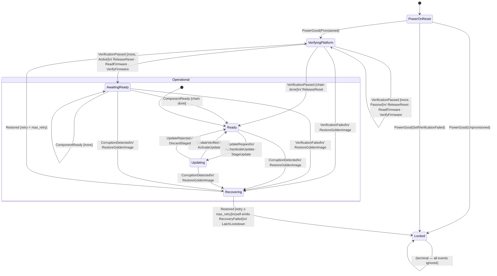

# `rot_reducer`

A reusable **Root-of-Trust HSM** state machine for OCP-style platform security,
written as a *sans-IO* reducer: the core is a pure function of
`(state, event, shared storage)` — where *shared storage* is statig's term for
the single struct passed into every handler, shared across all states because
states are unit variants that carry no data themselves; here that struct is
`Rot<N>`, holding the chain cursor (an index into the ordered list of components
being verified, so the walk can resume across events), retry count, and the rest of the machine's
persistent data — that **describes**
side effects instead of performing them. It never touches hardware, never reads the world, and names no
concrete component — a board layer supplies all of that.

Engine: [`statig`](https://crates.io/crates/statig) 0.4.1 with hand-written
(macro-free) trait impls. `#![no_std]`, `#![forbid(unsafe_code)]`, two deps
(`heapless` + `statig`).

```text
        world (board / shell)                          this crate (pure core)
   ┌───────────────────────────┐                 ┌──────────────────────────────┐
   │  reads OTP/UFM, hardware   │   Event  ──────►│  Orchestrator (dispatch loop)│
   │  IRQs, measurement results │                 │      │                       │
   │                            │                 │      ▼                       │
   │  Platform::execute(effect) │◄────── Effect ──│  StateMachine<Rot<N>>        │
   │  drives flash/reset/bus    │                 │   State × Superstate handlers│
   └───────────────────────────┘                 └──────────────────────────────┘
     examples/board.rs                              src/lib.rs
```

The world speaks to the core **only** through `Event`s; the core speaks back
**only** through `Effect`s. That single firewall is what makes every run
replayable and every test an assertion over an ordered `Vec<Effect>`.

## An execution model for OpenPRoT

This crate is an **executable model of the OpenPRoT PRoT security lifecycle** —
the boot-time trust chain, runtime attestation, firmware update, and corruption
recovery that a Platform Root of Trust is responsible for.

**Why a model, and why executable.** The OpenPRoT specification defines that
lifecycle around NIST SP 800-193's *protect → detect → recover* pillars, but the
sections that would pin down the PRoT's own behaviour — **PRoT Resiliency**,
**Firmware Recovery**, and **Secure Boot** — are still `TBD` prose. A sans-IO
reducer turns that prose into something concrete: each requirement becomes a
state transition, and every mandated behaviour becomes an assertion over an
ordered `Vec`. The effect trace *is* the normative behaviour, so the
model doubles as a runnable, testable specification rather than a document that
can drift from any implementation.

Its vocabulary maps onto the OpenPRoT service/application layers:

| OpenPRoT concern | Here |
| --- | --- |
| Secure Boot (reads → verifies → releases) | `VerifyingPlatform` / `ReadFirmware` + `VerifyFirmware` / `ReleaseReset` |
| Firmware Recovery + resiliency (detect → recover → lock) | `CorruptionDetected` → `Recovering` / `RestoreGoldenImage` → `Locked` |
| Attestation (SPDM responder) | `AttestationChallenge` / `SignAttestation` |
| Firmware Update | `Updating` / `StageUpdate` / `ActivateUpdate` |
| Device provisioning gate | `PowerGood(PowerOnResult)` |

**Faithful to real silicon, by design.** The model tracks the behaviour of a
production PRoT (the Aspeed AST1060 firmware) rather than an idealisation:
identity/DICE key derivation is *not* modelled here because on that hardware it
happens one boot layer down (ROM + measuring bootloader) before this machine
runs — so the machine starts at platform verification, and "attestation key
available" is a power-on precondition carried in `PowerOnResult`. Likewise it
models the trust *logic* only; the hardware choreography (reset lines, SPI/SMBus
filters, power sequencing) lives in the board `Platform`, mirroring OpenPRoT's
own split that scopes PRoT-hardware mechanisms out to the integrator.

## Layers

| Layer | Lives in | Knows about |
| --- | --- | --- |
| **Core** (state machine + dispatch loop) | `src/lib.rs` | opaque ids only — no hardware, no counts |
| **Board / deployment policy** | `examples/board.rs` | concrete components, chain order, capacity, retry cap; measurement transport (SPI interposition, I3C, MCTP, …) |
| **Shell / OS loop** | the caller | event delivery, effect routing, threading |

The core is generic over chain capacity (`N`) and takes `max_retry` as a
constructor argument; the board picks both.

## State machine



**`Operational` superstate** (`Ready` / `Updating` / `Recovering` / `AwaitingReady`): two events are
handled once here rather than duplicated across all four states:

- `AttestationChallenge` → `SignAttestation` (handled, no transition)
- `CorruptionDetected(id)` → `Recovering` (sets `rot.failed`)

**`VerifyingPlatform` walk**: the cursor into the chain is kept in `Rot` shared
storage. Each `VerificationPassed` either advances the cursor (returning
`Outcome::Handled`) or, when the last component passes, transitions to `Ready`.
For `Active` components the machine transitions to `AwaitingReady` until
`ComponentReady` signals the iRoT's own check passed.
`Outcome::Handled` is used deliberately — a self-transition would reset the cursor.

**Recovery retry loop**: on `Restored`, if `retry_count < max_retry` the machine
re-enters `VerifyingPlatform` to re-walk the full chain. On exhaustion, the
`Recovering` handler emits `Effect::Emit(RecoveryFailed)`; the orchestrator
dispatches that follow-up event before returning, driving the machine to `Locked`
entirely within one `dispatch_with` call.

### Cold boot happy path (Passive components)

```
Board / shell                       rot_reducer core
     |                                     |
     | PowerGood(Provisioned)              |
     |------------------------------------>| → VerifyingPlatform (entry)
     |<-- ReadFirmware(C0) ----------------| emit
     |<-- VerifyFirmware(C0) --------------| emit
     |   (board reads & verifies C0)       |
     | VerificationPassed(C0)              |
     |------------------------------------>| Outcome::Handled, cursor → 1
     |<-- ReleaseReset(C0) ----------------| emit
     |<-- ReadFirmware(C1) ----------------| emit
     |<-- VerifyFirmware(C1) --------------| emit
     |   (board reads & verifies C1)       |
     | VerificationPassed(C1)              |
     |------------------------------------>| → Ready (chain done)
     |<-- ReleaseReset(C1) ----------------| emit
```

## The types, by role

### 1. Vocabulary — the data the world and core exchange

| Type | Role |
| --- | --- |
| **`ComponentId`** | Opaque component identity (a `u8` the core never interprets). The board maps each id to real hardware; the core only ever compares and carries them. `new(u8)` / `get() -> u8`. |
| **`ComponentKind`** | Whether a component is `Active` (has an embedded iRoT that self-verifies) or `Passive` (firmware verified solely by the eRoT). Supplied by the board per chain entry. |
| **`PowerOnResult`** | Result of the power-on provisioning read — `Provisioned` / `Unprovisioned` / `SelfVerificationFailed`. Delivered *as event data* (see "reads as events"), never pulled by the core. |
| **`Event`** | Everything the world can tell the core: `PowerGood(PowerOnResult)`, `VerificationPassed(id)`, `VerificationFailed(id)`, `ComponentReady(id)`, `AttestationChallenge`, `UpdateRequest`, `UpdateVerified`, `UpdateRejected`, `CorruptionDetected(id)`, `Restored(id)`, `RecoveryFailed`. |
| **`Effect`** | Everything the core can ask the world to do: `ReadFirmware(id)`, `VerifyFirmware(id)`, `ReleaseReset(id)`, `SignAttestation`, `AuthenticateUpdate`, `StageUpdate`, `ActivateUpdate`, `DiscardStaged`, `RestoreGoldenImage(id)`, `LatchLockdown` — plus one **internal** variant, `Emit(Event)`, that never reaches hardware (see "feedback as data"). |

### 2. The machine — states and shared storage

| Type | Role |
| --- | --- |
| **`State`** | The 7 leaf states: `PowerOnReset`, `VerifyingPlatform`, `AwaitingReady`, `Ready`, `Updating`, `Recovering`, `Locked`. Unit variants — no state-local data. |
| **`Superstate<'sub>`** | The single superstate `Operational`, shared by `Ready`/`Updating`/`Recovering`/`AwaitingReady`. Handles what's answerable in any operational state (attestation challenge, runtime-corruption watch) so those handlers aren't duplicated. |
| **`Rot<const N: usize>`** | The `statig` shared storage: the trust `chain` of `(ComponentId, ComponentKind)` pairs (capacity `N`), the walk `cursor`, the `failed` component, `retry_count`, the `max_retry` cap, and `awaiting` (the `Active` component currently waited on, if any). Built with `Rot::new(chain, max_retry)`. Note what's *absent*: no `effects` field — effects live in the `Sink`, not here. |
| **`Sink`** | The inert effect buffer handed to every handler as the `statig` `Context`. Its **only** capability is `emit(effect)` — it cannot read the world or do I/O. The orchestrator owns a fresh `Sink` per dispatch and drains it after `handle` returns, so nothing effectful ever lives in shared storage. This is the core sans-IO trick (see the design moves below). |

`State` and `Superstate` implement `statig`'s handler traits for `Rot<N>`
(`call_handler`, `call_entry_action`, `superstate`); those `impl` blocks *are*
the transition logic.

### 3. The seams — how the core touches the world

| Type | Role |
| --- | --- |
| **`Platform`** | The **OUT** seam: `execute(&mut self, effect: Effect)` performs one external side effect. This is the *only* outward capability. There is deliberately no reader method — the world speaks *in* through `Event`s, not through core-initiated reads. Never called with `Effect::Emit`. |
| **`EventSource`** | The **opt-in IN** seam: `next_event(&mut self) -> Event`. Only needed if you use the `run` loop instead of driving an `Orchestrator` yourself — a caller running its own loop never implements it. |

**Why `EventSource` is opt-in (and `Platform` isn't).** There are two ways to
drive the machine, and `EventSource` matters to only one of them:

1. **You own the loop** (the normal path): hold an `Orchestrator` and push each
   event in with `dispatch` / `dispatch_with`, sourcing events however your
   system already does (an ISR queue, an RTOS mailbox, a scheduler). You never
   implement `EventSource`.
2. **The crate owns the loop** (a convenience): call `run`, and *it* loops
   forever — which means it has to **pull** the next event from somewhere. That
   "somewhere" is `EventSource::next_event`. It exists solely to feed `run`.

The two seams are asymmetric on purpose. `Platform` (OUT) is effectively
required because effects always have to go *somewhere* — every dispatch produces
them. `EventSource` (IN) is optional because event delivery is a question of
*who owns the fetch loop*: **you push** into `dispatch`, or **`run` pulls** via
`EventSource`. On real RoT hardware, events are already produced by the platform
(interrupts, mailboxes) and the integrator already has a loop, so `dispatch`
(push) is the expected default and `run` + `EventSource` is just an opt-in
shortcut for simple setups — `examples/board.rs` iterates a fixed script and
doesn't implement `EventSource` at all.

### 4. The dispatch loop — running the machine

| Type | Role |
| --- | --- |
| **`Orchestrator<const N: usize>`** | The opaque handle a caller steps from its own loop. Wraps `StateMachine<Rot<N>>` so callers **never name a `statig` type**. Its weight is in `dispatch_with(event, on_effect)`: it dispatches one event **to completion** — buffering internal `Effect::Emit` follow-ups and re-dispatching them FIFO before returning — invoking `on_effect` once per *external* effect in emission order. `dispatch(&mut impl Platform, event)` is sugar for the `Platform` path; `state()` reports the current leaf; `new(chain, max_retry)` builds it. |
| **`run<N>(io, chain, max_retry) -> !`** | Batteries-included loop for callers who want the crate to own the loop: pull an event via `EventSource`, dispatch it to completion via `Platform`, forever. Built on `Orchestrator`; callers who already have a loop should hold an `Orchestrator` and step it instead. |

## The three design moves

This crate sits one notch off the strict sans-IO end of the purity spectrum.
Three deliberate mechanical choices define it:

1. **Effects flow through an inert `Sink` in `Context`** — handlers call
   `ctx.emit(..)`, not `rot.emit(..)`. Because the effect buffer lives in the
   orchestrator-owned context (fresh per dispatch), there is no effect queue in shared
   storage, and therefore no `before_dispatch` clear hook. Purity is unchanged:
   the `Sink` can only append effects, never read or perform I/O.

2. **Feedback as data (`Effect::Emit`)** — a handler can schedule a follow-up
   event by emitting `Effect::Emit(event)`. The orchestrator intercepts it and
   re-dispatches FIFO before returning. This is used to enforce the recovery-retry
   cap **inside the core** (INV7): on the `max_retry`-th failed `Restored`, the
   `Recovering` handler self-emits `RecoveryFailed` → `Locked`, with no external
   watchdog — and the whole decision is visible in the effect trace.

3. **Reads as events (no reader lane)** — the core has no synchronous read
   capability. Where a decision needs a world read (provisioning status at
   power-on), the shell performs it and delivers the result *in the event*:
   `Event::PowerGood(PowerOnResult)`. The core stays a pure function of its inputs.

## Invariants

The behaviours the tests lock in. Each is referenced by id in the source and
test comments so a failing test points directly at the requirement it broke.

| ID | Statement | Verified by |
| --- | --- | --- |
| **INV1** | A provisioned power-on always enters `VerifyingPlatform` (never `Ready` or `Locked` directly). | `cold_boot_walks_chain_in_order` |
| **INV2** | No `ReleaseReset(id)` is ever emitted before the corresponding `VerificationPassed(id)` arrives — components are only freed once verified. | `cold_boot_walks_chain_in_order` |
| **INV3** | Components are measured and released in chain order; no component is skipped or released out of sequence. | `cold_boot_walks_chain_in_order` |
| **INV4** | A rejected firmware update rolls back via `DiscardStaged` and returns to `Ready`; it never triggers `Recovering` or `Locked`. | `update_rollback_is_not_recovery` |
| **INV5** | `CorruptionDetected(id)` issues `RestoreGoldenImage(id)` for the exact named component; after `Restored` the full trust chain is re-walked from component 0. | `runtime_corruption_targets_component_and_rewalks` |
| **INV6** | `AttestationChallenge` produces `SignAttestation` from every `Operational` state (`Ready`, `Updating`, `Recovering`, `AwaitingReady`) without a state change. | `attestation_shared_across_operational_states` |
| **INV7** | After `max_retry` consecutive failed restores the core self-emits `RecoveryFailed` and latches to `Locked` — no external `RecoveryFailed` event is required. | `retry_cap_self_latches_via_emit` |
| **INV8** | The core never inspects the contents of a `ComponentId`; it only carries and equality-compares the opaque value. All hardware mapping belongs to the board. | test setup comment |

## Usage

```rust
use rot_reducer::{ComponentId, ComponentKind, Orchestrator, Event, PowerOnResult, State};

// Board policy (the core defines none of this):
const CAPACITY: usize = 8;
const MAX_RETRY: u8 = 3;
const BMC: ComponentId = ComponentId::new(0);
const HOST: ComponentId = ComponentId::new(1);

let mut chain = heapless::Vec::<(ComponentId, ComponentKind), CAPACITY>::new();
let _ = chain.push((BMC, ComponentKind::Passive));
let _ = chain.push((HOST, ComponentKind::Passive));

let mut orch = Orchestrator::new(chain, MAX_RETRY);
let mut effects = Vec::new();

for ev in [
    Event::PowerGood(PowerOnResult::Provisioned),
    Event::VerificationPassed(BMC),
    Event::VerificationPassed(HOST),
] {
    orch.dispatch_with(ev, |e| effects.push(e)); // one step of the caller's loop
    if orch.state() == State::Locked { break; }
}

assert_eq!(orch.state(), State::Ready);
```

A complete worked integration — a `Platform` impl, the component map, and a cold
boot to `Ready` — is in [`examples/board.rs`](examples/board.rs):

```sh
cargo run --example board
```

## Using it from a `pw_kernel` task

Because OpenPRoT runs on Pigweed's `pw_kernel`, the natural home for this crate
is a userspace task. The task **is the shell/board layer**: it owns the loop,
does the IPC, and holds the `Orchestrator` across iterations — while the pure
core names no syscall, channel, or component.

The shape is a direct copy of OpenPRoT's own MCTP server task
(`target/ast10x0/tests/spdm/mctp_server/src/main.rs`), whose server crate states
the same split outright: *"the server does not depend on any OS primitives; the
platform layer drives the event loop."* That task does
`object_wait → channel_read → decode → dispatch → channel_respond`; a RoT task
does the same, with `dispatch` driving the `Orchestrator` and each `Effect`
becoming an IPC transact:

| MCTP server task | RoT task driving `rot_reducer` |
| --- | --- |
| holds `Server<S, N>` | holds `Orchestrator<N>` |
| `channel_read` → `MctpRequestHeader::from_bytes` | `channel_read` → decode into an `Event` |
| `dispatch(&header, …)` | `orch.dispatch(&mut platform, event)` |
| `channel_respond(resp)` | each `Effect` → `channel_transact` to a driver task |
| one channel in the wait group | reset / measure / attest / corruption channels fanned in |

```rust,ignore
#[entry] // #![no_std] #![no_main]
fn entry() {
    let mut orch = Orchestrator::new(chain, MAX_RETRY);   // held across the loop
    // fan in every event source, like wait_group_add in the MCTP task
    for h in [handle::RESET_IRQ, handle::UPDATE, handle::ATTEST, handle::CORRUPT] {
        let _ = syscall::wait_group_add(handle::WG, h, Signals::READABLE, 0);
    }
    let mut buf = [0u8; 32];
    loop {
        let _ = syscall::object_wait(handle::WG, Signals::READABLE, Instant::MAX);
        let n = syscall::channel_read(handle::RESET_IRQ, 0, &mut buf).unwrap_or(0);
        let Some(event) = decode_event(&buf[..n]) else { continue };
        orch.dispatch_with(event, |eff| execute(eff)); // execute = channel_transact per effect
    }
}
```

Three things this makes concrete:

- **The task owns its loop, so it uses `dispatch` (push) — not `run` /
  `EventSource`.** A `pw_kernel` task already has its loop (`object_wait`) and
  event sources (channels); handing that to a `-> !` `run` would fight the kernel
  model. This is the payoff of the opt-in `EventSource` seam.
- **`Platform::execute` is `channel_transact` to other server tasks** — a flash
  server, a crypto/attestation server, a GPIO/reset controller. The opaque
  `ComponentId` rides along as a request byte the driver task decodes, exactly
  like the MCTP task decodes `MctpOp`.
- **Effects that need a result come back as a later `Event`, not a return
  value.** `ReadFirmware(id)` + `VerifyFirmware(id)` *kick off* the firmware check; the result
  arrives as `Event::VerificationPassed(id)` on a later loop turn (reads-as-events),
  so long-running work never blocks the reducer — it's just another readable
  channel in the wait group.

A host-runnable sketch with a `Platform`-as-IPC impl, an event decoder, and a
scripted channel inbox is in [`examples/pw_task.rs`](examples/pw_task.rs):

```sh
cargo run --example pw_task
```

## Testing

The firewall's payoff is **effect-trace-as-oracle** testing: because the machine
*describes* effects instead of performing them, every test drives a script of
events and asserts on the ordered `Vec<Effect>` and the final `State`. See the
`tests` module in [`src/lib.rs`](src/lib.rs); run with `cargo test` (unit tests +
the doctest above).

## Glossary

| Term | Meaning |
| --- | --- |
| **RoT** | Root of Trust — a hardware security engine that anchors platform trust. |
| **PRoT** | Platform Root of Trust — the RoT subsystem responsible for the platform boot-time trust chain (measure, verify, release) and runtime resiliency. |
| **PA-RoT** | Platform Active Root of Trust — OCP/Cerberus terminology for the platform-level RoT device that actively gates components (holds in reset, verifies, releases or recovers). This is the role this machine models. The core is transport-agnostic: whether the board implements measurement via SPI interposition, I3C, MCTP, or another mechanism is a board-layer choice. |
| **SPI interposition** | A board-layer measurement technique where the RoT MCU sits physically inline between the host SoC/BMC and its SPI flash chip. Because all flash reads pass through the RoT, it can read the firmware image directly off the bus at power-on — without the host being involved — hash it, check it against the RIM, and only then release the host from reset. The RoT can also enforce write-protection on flash regions at runtime, so a compromised running host cannot persist malware. The core has no knowledge of this: from its perspective it emits `ReadFirmware(id)` + `VerifyFirmware(id)` and waits for `VerificationPassed(id)`; the board layer decides whether that happens over SPI, I3C, an MCTP channel, or any other transport. |
| **AC-RoT** | Active Component Root of Trust — a per-peripheral RoT embedded in each component (NIC, SSD, GPU) that provides signed firmware measurements when challenged by the PA-RoT. Not modelled here; this machine represents the PA-RoT logic. |
| **HSM** | Hardware Security Module — a tamper-resistant device that performs cryptographic operations and key management. Used loosely in the crate description to indicate the security domain; this crate models the RoT *state machine logic*, not a classical standalone HSM product. |
| **OCP** | Open Compute Project — the industry consortium whose platform security specifications (including OpenPRoT and the Cerberus architecture) this crate models. |
| **OpenPRoT** | The OCP PRoT security lifecycle specification: Secure Boot, attestation, firmware update, and resiliency, structured around NIST SP 800-193. |
| **NIST SP 800-193** | *Platform Firmware Resiliency Guidelines* — defines the *protect → detect → recover* pillars that structure the state machine's lifecycle. |
| **Chain of trust** | The ordered sequence of `ComponentId`s in `Rot.chain` that the machine walks during `VerifyingPlatform`. Each component is verified before its successor is touched; the order is a board-layer policy choice. |
| **RIM** | Reference Integrity Manifest — the authoritative record of known-good firmware digests for each component. `VerifyFirmware(id)` asks the platform to check a freshly read image against it. The RIM is owned by the board/platform layer; the core never sees its contents. Called **PFM** (Platform Firmware Manifest) in the Cerberus/OCP vocabulary — same concept, different spec lineage. |
| **Golden image** | The known-good firmware copy that `RestoreGoldenImage(id)` asks the board to write back to a corrupted component. Stored in protected storage managed by the board; the core never reads it. |
| **PFM** | Platform Firmware Manifest — the Cerberus/OCP name for the signed per-component firmware policy. See **RIM** above. |
| **DICE** | Device Identifier Composition Engine — a TCG standard for layered identity and attestation key derivation. Not modelled here; it runs one boot layer below (ROM + measuring bootloader) before this machine starts. |
| **SPDM** | Security Protocol and Data Model (DMTF DSP0274) — the request/response protocol used for attestation challenges. `AttestationChallenge` / `SignAttestation` represent the SPDM responder path. |
| **MCTP** | Management Component Transport Protocol — the underlying transport for SPDM and other management messages on OCP platforms. Referenced in the `pw_kernel` task analogy. |
| **Sans-IO** | A design pattern where a core library never performs I/O itself; it only accepts inputs and returns/emits descriptions of effects. All I/O is delegated to the caller (the board/shell layer here). |
| **Effect trace** | The ordered sequence of `Effect` values emitted during a run. Because the core is pure, this trace fully determines observable behaviour and serves as the oracle in tests. |
| **PowerOnResult** | The power-on state read from OTP/UFM indicating whether the device has been provisioned with its identity and self-verification passed. Delivered to the core as event data (`PowerGood(PowerOnResult::Provisioned/Unprovisioned/SelfVerificationFailed)`) rather than read directly. |
| **OTP / UFM** | One-Time Programmable fuses / User Flash Memory — non-volatile storage on the SoC where provisioning state and secrets are kept. Read by the board layer, never by the core. |
| **ComponentId** | An opaque `u8` handle the core uses to identify a platform component (BMC firmware, host firmware, etc.) without knowing anything about it. The board maps ids to real hardware. |
| **`statig`** | The Rust hierarchical state-machine framework (`crates.io/crates/statig`) used as the engine. Its handler traits are implemented by hand (macro-free) in `src/lib.rs`. |
