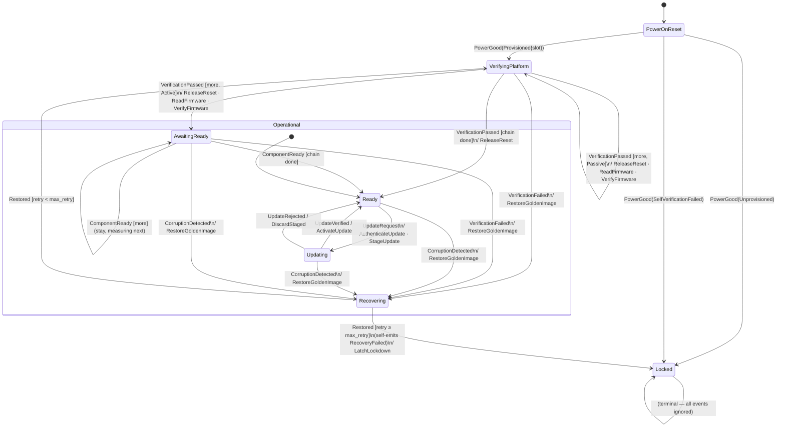

# `rot_reducer` CSA Extension — Design

> **Status:** Draft
> **Scope:** Extends `rot_reducer` to cover the gaps identified against the
> Composable Security Architecture (CSA) boot sequence document.

---

## 1. Problem statement

`rot_reducer` models one eRoT's flat trust chain: measure a component, confirm
it, release it, advance the cursor, repeat. That matches the AST1060 execution
model well. The CSA boot sequence document describes a richer architecture:

| # | Gap | Core or board? |
|---|---|---|
| G1 | eRoT self-verification (A/B slot selection, immutable ROM boundary) | Board today; optionally Core |
| G2 | Dual-layer verification: eRoT authenticates from flash *then* releases; iRoT performs a second independent check *after* release | Core — needs a new event and state to model the wait |
| G3 | Inter-component readiness gate (e.g. MCTP channel established before CPU measurement begins) | Core — same new event as G2 |
| G4 | SVN / anti-rollback enforcement | Board (already opaque in `CompareToRim`) |
| G5 | Passive vs. active device type (iRoT present or not) | Core — drives G2/G3 branching |
| G6 | Three-tier hierarchy (node eRoT → subsystem eRoT → accelerators) | Composition of two Orchestrators — no core change |
| G7 | PCIe enumeration and bootloader hand-off | Out of scope by design |

Gaps G2, G3, and G5 require additive changes to the core vocabulary and state
machine. G1 requires a scoping decision. G4 and G6 fit the existing model once
the scoping is clarified. G7 is intentional.

---

## 2. Scoping decisions

### G1 — Self-verification stays below the machine boundary

The existing README correctly describes the boundary: immutable ROM and the
measuring bootloader (mcuboot / equivalent) run *below* this machine and
establish self-integrity before `PowerGood` is emitted. That is not an
omission — it mirrors real silicon (AST1060) and OpenPRoT's own split.

For CSA compliance, the board layer reads the active firmware slot from OTP,
performs the ROM-based self-check, and only then signals `PowerGood`. The
A/B-slot outcome becomes a new `PowerGood` field rather than a new machine
state:

```rust
pub enum PowerOnResult {
    /// Self-verified, provisioned, active slot known.
    Provisioned { active_slot: SlotId },
    /// Self-verified, but not provisioned — cannot act as a RoT.
    Unprovisioned,
    /// Self-verification failed; the board should attempt A/B recovery before
    /// emitting this.  The machine will latch to Locked immediately.
    SelfVerificationFailed,
}

pub enum Event {
    PowerGood(PowerOnResult),   // replaces PowerGood(Provisioning)
    // … rest unchanged
}
```

The board delivers the slot selection and provisioning status together.
`SelfVerificationFailed` lets the core reach `Locked` in the same dispatch that
delivers the bad news, without adding a new pre-boot state. Whether A/B retry
is attempted *before* this event is fired is a board-layer policy choice.

> **Backward compatibility:** `Provisioning` is replaced by `PowerOnResult`.
> The `Provisioned` / `Unprovisioned` arms map 1-to-1. `SelfVerificationFailed`
> is additive.

### G4 — SVN enforcement stays in the board layer; effect renamed

**Naming.** `rot_reducer` inherited `CompareToRim` from the OpenPRoT /
NIST SP 800-193 lineage, where a RIM (Reference Integrity Manifest) is the
signed per-component policy document. The CSA document does not use that term;
its verification vocabulary is simply *"signature + SVN"*. To align with CSA
language the effect is renamed:

```
CompareToRim(ComponentId)  →  VerifyFirmware(ComponentId)
```

`VerifyFirmware` is still deliberately opaque — the board's `Platform::execute`
implementation decides what verification entails (signature check, SVN floor,
digest comparison against a manifest, or any combination). No semantic change;
pure rename. The constraint to document (as a convention, not a type) is:

> `VerifyFirmware` MUST reject a component whose SVN is below the policy
> minimum. A `VerificationFailed` event follows a rejection; a `VerificationPassed`
> event follows acceptance. The core enforces the sequencing; the board enforces
> the policy.

### G7 — PCIe enumeration and bootloader hand-off remain out of scope

The machine terminates at `Ready`. Everything above the firmware layer (OS,
hypervisor, PCIe enumeration) is the shell layer's concern and is not modelled.

---

## 3. New vocabulary

### 3.1 `ComponentKind`

A component is either *active* (carries an integrated iRoT, e.g. Caliptra) or
*passive* (no local verifier; the eRoT is its only trust gate):

```rust
#[derive(Clone, Copy, PartialEq, Eq, Debug)]
pub enum ComponentKind {
    /// The component has an integrated iRoT (e.g. Caliptra). Two independent
    /// authentication checks apply:
    ///   1. The eRoT reads the component's firmware from the flash it controls
    ///      (SPI interposition or equivalent), verifies the signature and SVN,
    ///      and only then emits `ReleaseReset`. This is the existing
    ///      `ReadFirmware` / `VerifyFirmware` path.
    ///   2. After reset is released, the iRoT performs its own local
    ///      measurement and verification before transferring execution. The
    ///      eRoT waits for the component to signal readiness (`ComponentReady`)
    ///      before advancing the chain walk to the next component.
    /// Both checks are required; they guard against different threat vectors.
    Active,
    /// No local iRoT. The eRoT's authentication from flash and release are the
    /// only trust gate. The chain walk advances immediately after `ReleaseReset`.
    Passive,
}
```

The annotated chain replaces the bare `heapless::Vec<ComponentId, N>`:

```rust
// Board constructs this:
heapless::Vec<(ComponentId, ComponentKind), N>
```

`ComponentId` and `ComponentKind` remain opaque in the core; the board
supplies the kinds alongside the ids. The core never inspects `ComponentId`
bits and never acts on `ComponentKind` in a hardware-specific way — it only
uses the kind to decide whether to enter `AwaitingReady` after a release.

### 3.2 `Event::ComponentReady(ComponentId)`

A new inbound event that signals an active component has finished its local
boot and is ready to participate (e.g. MCTP channel established, iRoT
measurement complete, management service running):

```rust
pub enum Event {
    PowerGood(PowerOnResult),
    VerificationPassed(ComponentId),
    VerificationFailed(ComponentId),
    ComponentReady(ComponentId),     // NEW — active component signalled readiness
    AttestationChallenge,
    UpdateRequest,
    UpdateVerified,
    UpdateRejected,
    CorruptionDetected(ComponentId),
    Restored(ComponentId),
    RecoveryFailed,
}
```

This follows the "reads as events" principle. For an `Active` component, the
eRoT has already authenticated its firmware from flash (via `ReadFirmware`
/ `VerifyFirmware`) before emitting `ReleaseReset`. `ComponentReady` models the
*second*, independent check: the board observes that the iRoT has completed its
own local measurement and the component is operational (e.g. MCTP channel
established, management services running), then delivers that observation as
`ComponentReady`. The core remains a pure function; it never reads the channel
or polls the iRoT directly.

### 3.3 Effect rename: `CompareToRim` → `VerifyFirmware`

No new effect variants are added. `ReleaseReset(id)` already removes the reset
line; `ReadFirmware(id)` already reads the firmware image.
`CompareToRim(id)` is renamed to `VerifyFirmware(id)` (see §G4). The new event
`ComponentReady` is the only addition to the vocabulary.

---

## 4. State machine changes

### 4.1 New state: `AwaitingReady`

After the eRoT releases an `Active` component from reset, the chain walk
pauses. The component boots, its iRoT verifies and executes its firmware, and
it signals readiness. Only then does the eRoT advance the cursor and begin
measuring the next component.

```rust
pub enum State {
    PowerOnReset,
    VerifyingPlatform,
    AwaitingReady,          // NEW
    Ready,
    Updating,
    Recovering,
    Locked,
}
```

`AwaitingReady` carries no data (like all other states). The `ComponentId` of
the component we are waiting on is already tracked by `rot.cursor` — the board
knows which component it is from the most recently emitted `ReleaseReset`.

### 4.2 Updated `VerifyingPlatform` handler

```
Event::VerificationPassed(id) in VerifyingPlatform:
    emit ReleaseReset(id)
    if chain done:
        → Ready
    else if next component is Active:
        advance cursor
        emit ReadFirmware(next)
        emit VerifyFirmware(next)
        → AwaitingReady          ← new branch
    else (Passive):
        advance cursor
        emit ReadFirmware(next)
        emit VerifyFirmware(next)
        Outcome::Handled          ← unchanged
```

For a `Passive` component the chain walk advances immediately (existing
behaviour): the eRoT's authentication from flash is the only trust gate, so
there is nothing further to wait for.

For an `Active` component the eRoT has already authenticated the firmware from
flash before arriving here (`ReadFirmware` / `VerifyFirmware` ran
before the `VerificationPassed` event was received). `ReleaseReset` is emitted,
then the machine transitions to `AwaitingReady` to wait for the iRoT's
independent second check. The measurement request for the *next* component
(`ReadFirmware(next)` / `VerifyFirmware(next)`) is emitted in the
same batch: the eRoT can read the next component's flash off the SPI bus while
the prior component's iRoT is still running. The board may pipeline this or
defer it; either way the core emits it immediately and will receive
`VerificationPassed(next)` when the board is ready.

### 4.3 `AwaitingReady` handler

```
Event::ComponentReady(id) in AwaitingReady:
    // Confirm the id matches what we expect (INV10).
    let expected = rot.chain[rot.cursor].0;
    if id == expected:
        if chain done:
            → Ready
        else:
            Outcome::Handled    (cursor already advanced; already measuring next)
    else:
        Outcome::Handled        (stale/spurious ready from a different component — ignore)

Event::VerificationFailed(id) in AwaitingReady:
    rot.failed = Some(id)
    → Recovering                (verification result arrived while waiting — handle it)

Event::VerificationPassed(id) in AwaitingReady:
    // The eRoT's measurement of the *next* component is already done.
    // Release it, then wait for its readiness.
    emit ReleaseReset(id)
    if chain done after this:
        → Ready
    else if next-next is Active:
        advance cursor
        emit ReadFirmware(next-next)
        emit VerifyFirmware(next-next)
        Outcome::Handled        (stay in AwaitingReady, now waiting on next component)
    else:
        advance cursor
        emit ReadFirmware(next-next)
        emit VerifyFirmware(next-next)
        Outcome::Handled
```

`AwaitingReady` handles `AttestationChallenge` and `CorruptionDetected` by
also being inside `Operational` — see §4.5.

### 4.4 `Rot` shared storage addition

One field is added to track whether the current wait is for an active
component, and which one:

```rust
pub struct Rot<const N: usize> {
    chain:       heapless::Vec<(ComponentId, ComponentKind), N>,
    cursor:      u8,
    failed:      Option<ComponentId>,
    retry_count: u8,
    max_retry:   u8,
    // NEW: id of the active component we are waiting on, if any.
    awaiting:    Option<ComponentId>,
}
```

`awaiting` is `Some(id)` whenever the machine is in `AwaitingReady` and `None`
in every other state. It is cleared on entry to `VerifyingPlatform` (along
with `cursor`).

### 4.5 `Operational` superstate membership

`AwaitingReady` joins the `Operational` superstate so that attestation
challenges and runtime corruption events are handled identically regardless of
whether we are mid-chain-walk or have finished it:

```rust
fn superstate(&mut self) -> Option<Superstate<'_>> {
    match self {
        State::Ready | State::Updating | State::Recovering
        | State::AwaitingReady                              // NEW
        => Some(Superstate::Operational(PhantomData)),
        _ => None,
    }
}
```

### 4.6 Revised state diagram



---

## 5. Three-tier hierarchy (G6) — composition, no core change

The CSA heterogeneous compute model has:

```
Node eRoT → verifies → Subsystem eRoT → verifies → Accelerator devices
```

Each tier is its own `Orchestrator` with its own chain. The *subsystem eRoT*
is just another `ComponentId` (kind `Active`) in the node eRoT's chain. The
shell/board wires them together:

```
                 ┌─────────────────────────────────────────────┐
                 │  node_orch: Orchestrator<NODE_CAP>           │
                 │  chain = [BMC(Active), CPU(Active),          │
                 │           SubsysErot(Active)]                │
                 └──────────────┬──────────────────────────────┘
                                │ ReleaseReset(SubsysErot)
                                ▼
                 ┌─────────────────────────────────────────────┐
                 │  subsys_orch: Orchestrator<SUBSYS_CAP>       │
                 │  chain = [GPU0(Active), GPU1(Active), …]     │
                 └──────────────┬──────────────────────────────┘
                                │ when subsys_orch.state() == Ready
                                ▼
                 node_orch.dispatch(ComponentReady(SubsysErot))
```

The board layer (the shell task) does this wiring: it starts `subsys_orch`
when `ReleaseReset(SubsysErot)` arrives from `node_orch`, runs it to
`Ready`, and then delivers `ComponentReady(SubsysErot)` to `node_orch`. From
the node eRoT's perspective, the subsystem eRoT is just another active
component that takes a while to signal readiness.

The core requires no changes for this. The `AwaitingReady` state is exactly
the right model: the node eRoT pauses the chain walk while the subsystem eRoT
does its own inner walk.

---

## 6. New invariants

These join the existing INV1–INV9:

| ID | Statement | Verified by |
|---|---|---|
| **INV10** | A `ComponentReady(id)` that does not match `rot.awaiting` is silently ignored; the walk does not advance on a stale or spurious ready signal. | `spurious_component_ready_is_ignored` |
| **INV11** | An `Active` component is never advanced past in the chain walk without a `ComponentReady(id)` arriving for it — the cursor does not move and the next component's measurement does not begin until the active component confirms readiness. | `active_component_gates_on_component_ready` |
| **INV12** | A `PowerGood(SelfVerificationFailed)` always transitions to `Locked` with `LatchLockdown` emitted, without ever entering `VerifyingPlatform`. | `self_verification_failure_latches_immediately` |
| **INV13** | `AttestationChallenge` is handled in `AwaitingReady` the same as in `Ready` / `Updating` / `Recovering` — without a state change. | `attestation_shared_across_operational_states` (extended) |

---

## 7. API surface changes

### Additive

```rust
// New type
pub enum ComponentKind { Active, Passive }

// New event arm
Event::ComponentReady(ComponentId)

// New event arm (replaces Provisioning variants)
Event::PowerGood(PowerOnResult)   // PowerOnResult replaces Provisioning

// New state arm
State::AwaitingReady
```

### Breaking (minimal)

| Old | New | Migration |
|---|---|---|
| `heapless::Vec<ComponentId, N>` chain | `heapless::Vec<(ComponentId, ComponentKind), N>` | Wrap each `id` as `(id, ComponentKind::Passive)` to preserve existing behaviour exactly |
| `Event::PowerGood(Provisioning)` | `Event::PowerGood(PowerOnResult)` | `Provisioned` → `Provisioned { active_slot: 0 }`; `Unprovisioned` → `Unprovisioned` |
| `Provisioning` type | `PowerOnResult` type | Rename + add `SelfVerificationFailed` arm |

Existing boards that use a flat chain of passive components and never see
`SelfVerificationFailed` only need the wrapping migration — the state machine
behaviour is identical for all-`Passive` chains.

---

## 8. What does not change

- The sans-IO contract: the core still has no reader lane, no I/O, no hardware.
- `Sink` / `Context` pattern: effects still flow through an inert per-dispatch
  buffer.
- `Effect::Emit` / feedback-as-data for recovery retry (INV8).
- `Orchestrator` API: `dispatch`, `dispatch_with`, `state`, `new` — same
  signatures, same opaqueness over `statig`.
- `Platform` trait: `execute(&mut self, effect: Effect)` — unchanged.
- `EventSource` trait and `run` loop — unchanged.
- `#![no_std]`, `#![forbid(unsafe_code)]`, two deps (`heapless` + `statig`).
- The board layer owns: component ordering, retry cap, transport (SPI / I3C /
  MCTP), slot selection, SVN policy, and subsystem-eRoT orchestration.- The semantics of firmware verification are unchanged — `VerifyFirmware` is
  a pure rename of `CompareToRim`; the board's `Platform::execute` impl
  decides what the check entails.
---

## 9. Implementation order

0. `CompareToRim` → `VerifyFirmware` — pure rename, no logic change. All
   existing tests and examples update mechanically.
1. `PowerOnResult` replaces `Provisioning` — rename + new arm, no logic change.
2. `ComponentKind` + annotated chain — additive type; existing board code wraps
   ids as `Passive`.
3. `AwaitingReady` state + `ComponentReady` event — new state and handler,
   existing paths unchanged for all-Passive chains.
4. New tests for INV10–INV13.
5. Update `examples/board.rs` to annotate the two-component chain
   (`BMC → Active`, `HOST → Active`) and wire `ComponentReady` signals.
6. Add `examples/csa_single_node.rs` with a three-component CSA chain
   (BMC Active, CPU Active, NICs Passive) to serve as a runnable reference for
   the single-node boot sequence.
